<p align="center"> 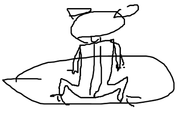 </p>

## Frog | 人工生命 
这是一个人工生命试验项目，最终目标是创建“有自我意识表现”的模拟生命体，技术架构基于02年提出的 [一个人工脑模型](other/一个人工脑模型.md)。这个项目永远没有结束的时候，开始于模拟一个简单的生命体，然后是青蛙、狗......, 结束于有“自我意识表现”的人工脑，或者说，结束于被机器人代替人类的那一天。  

## 缘起 | Origin
目前人工智能的进展已经比较完美地解决了模式识别这块的难题，人脸识别、语音识别已经不弱于人类的水平，而这是我在二十年前感到最困惑的一块。模式识别解决了，剩下的问题就简单多了，目前距离人工意识的诞生只差临门一脚了，就是如何在识别的基础上“理解”这些识别的内容并与人类形成交互的反馈。所以这个项目的重点是建立在模式识别基础上，训练神经网络形成条件反射，表现出高等动物才具有的条形反射行为，最终表现为"拥有自我意识"的行为。根据“意识不是一种存在，而是一种现象”原理，如果最终一个系统表现出具有自我意识的行为，即可认为它也是人，应该获得人权。目前有些人工智能的研究目的是想让人工智能解决一些复杂的人类社会方面的问题如机器翻译等，则是完全错误的目标，不可能成功，因为如果一个系统不能表现出自我意识，它就不能与人类交流，也就不可能具有解决这些问题的能力，表现出来的现象就是通常说的"机器不犯错，一旦犯错就是大错"。另一方面，如果一个系统表现出具有自我意识的行为，它就完全有能力解决世界上所有难题，包括改进它的自身和淘汰人类(因为他是先进生产力的代表）。所以人工智能的研究重点应该放在人工生命(或通用人工智能，人工生命和通用人工智能是等价的)的构建和伦理研究，而不是期待短期收益，指望人类可以一直享受人工智能的大餐是很危险的。模式识别和深度学习的成果只是通用人工智能的一个路标，人工智能的“有用”的应用期，很可能只是奇点之前白马过隙般短暂的一个过渡期而已，不用高兴得太早，也许都是白忙，给机器人作嫁衣。奇点之后，很可能所有生物智能都将淘汰。实际上，人工智能不光是技术问题，还是个人生观问题，专家的认识有时候并不总对。在此摘一段芦秋迪群友建议放上来的对话：  
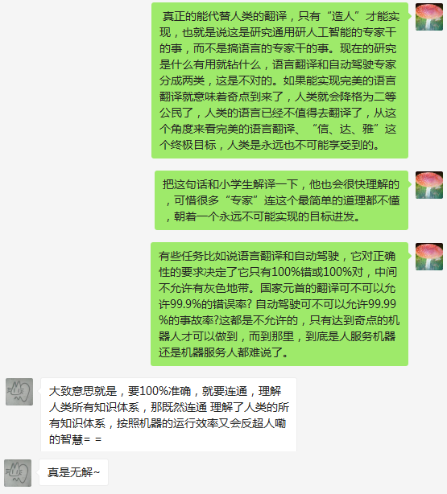  

简单来说，这个项目是一个民科项目，试图以实验为导向，模拟生命进化的过程，按照优胜夯汰、随机变异、用进废退这三大原则,一步一步地搭建出从低等到复杂的人工生命体，除了模式识别的成果可以借签，原则上不需要学习很多数学知识，因为它强调由实验来驱动，而不是由复杂的算法来搭建神经网络。目前神经网络研究重点在于模式识别，但对系统赋予条件反射功能关注不够，没有把无生命的神经网络和有意识的人类看作同一个等级的自然现象。  

从单细胞进化到多细胞、从青蛙进化到人类，这是一个漫长的、随机的进化过程，但在超级电脑上跑可能只要几天时间，就可能得到一个相当不错的脑模型。当然电脑速度越快、容量越大、环境模拟的越真实，则优胜夯汰后形成的脑结构就越复杂，错的脑模型都被自然淘汰掉了。从算法着手搭建，还是从模拟环境着手自动进化，这是创建人工生命的两个大方向，第一个方向有可能走到死胡同里，因为它不具备算法自改进、变异、遗传(算法的压缩)功能，当脑模型复杂到一定地步，可能会超出人脑能理解的范畴。模拟环境方式的难点则在于环境本身必须足够复杂、正确。而且必须循序渐进，与脑的进化同步，如果把一群青蛙扔到猴子的模拟环境中，则所有青蛙都会被自然淘汰掉，项目就无法进行下去了，另一个困难是电脑必须非常快，因为目前是用串行方式模拟并行算法，不断试错前进的过程。项目语言为Java，利用Swing作图环境，构建一个虚拟环境、并模拟一群草履虫的优胜夯汰，来获取一个具备自进化功能的人工生命体，具体脑(即电脑生成的神经网络)的生成、进化算法还需要以后逐渐加入。欢迎有对神经网络感兴趣的朋友一起来琢磨，这个项目不需要多少高等数学知识，重在实践。  

## 短期目标 | Sort-term Goals  
第一个初步目标是：造出一个真正意义上的人工生命：草履虫(备注：基本已完成)。它必须具备以下前四个特点：   
* 脑结构由电脑生成：神经网络由电脑算法生成，但是电脑算法仅限于模拟环境，而不是直接参与搭建神经网络，就好象大自然只负责拍死不合格的生命，它从不主动参与设计大脑。  
* 脑结构可遗传：类似于生物的DNA，电脑生成的脑结构(神经网络)，可通过简单的算法规则描述，并且此算法规则可以压缩成较短的片段存储，并参与到下一代草履虫的构建。  
* 脑结构可变异：算法规则可以变异，下一代生成的草履虫在脑结构上与上一代总体相似，但存在部分变异。  
* 适应环境：草履虫能够在模拟的虚拟环境下存活下来，环境有微小的变化，能够自适应环境，并一代代生存将适应这种环境的能力遗传下来。  
* 用进废退：这是一个假想，对于生物来说，存在这样一种现象，就是用的多的器官，容易发生变异（例如经常嚼槟榔，容易发生口腔癌变）,有理由相信这不是偶然现象，而是生物在进化过程中的一个有用的功能，以便于更快地变异，以适应环境，并很可能这种变异会通过遗传细胞影响到下一代。  

## 理论 | Theory  
为什么明明是个电脑程序，只要满足上述前四个特点就可以称之为"真正"的人工生命? 这一点我不想多说，大家可以搜索一下"zhangrex的造人论坛"就知道我的观点了：意识从来就不存在，意识只是一种现象。风吹、树动和风吹、添衣，都只是现象而已，意识本质上是一种现象，同理，只要表现出类似生命现象的事物，就可以称其为生命了，不管它是高等还是低等，不管它的物质存在基础是怎样的。二十年前我就开始思考这个问题，提出了“我思我不在”的口号，请仔细考虑一下这个观点，哲学上、理论上对智能、意识的研究是很无聊的，相当于在研究“不存在”到底是什么，不必多纠缠在理论和算法上。是的，用模拟环境得到的人工神经网络模型，我们确实无法掌控它的算法是怎样生成的，但是我们知道，这符合大自然创造生命的规律。

## 项目架构 | Architecture 
这是一个Java项目，分为Application、Env、Frog三个模块: 
Application模块: 用于项目的启动、关闭等基础服务，Windows环境下可以用run.bat来启动它查看演示。  
Env模块: 模拟一个生物生存区，用不同形状的图形点阵来表达和模拟食物、天敌、障碍等物体，这个虚拟空间由程序员全权控制，将随着Frog的脑进化而不断变得越来越复杂。  
Frog: 这是人工生命的主体，目前起名叫青蛙(Frog)，其实叫什么都一样。它主要具备以下器官：
* 运动器官: 与运动神经元相连，只有4个动作：上下左右。
* 进食器官：当Frog与食物的坐标重合时，食物会被从Env中删除，并相应增加Frog的能量值，并激活Frog的进食感觉神经元，随时间流逝能量将减少，能量耗尽则Frog死亡。  
* 视觉器官: 这是脑模型的一部分，在实验中先固定随意取脑内一片神经元区作为视觉区。    
* 脑器官: 这即是程序员要解决的问题，也是我们要获取的最终目标。脑模型的生成由电脑优胜夯汰、循环迭代进化生成，但这个进化的算法还是必须由程序员来掌控，一步步探索出来，即要防止虚拟环境太复杂，也要避免脑模型不适应环境，生命体全部被淘汰，导致实验中断，无法进行下去。     
	
## 技术细节和构思
* 通过数组来模拟神经网络，用串行的循环来模拟并行芯片运作方式。用Frog的能量多少来衡量是否将它淘汰还是允许它产生后代(下蛋)参与下一轮的测试，因为这个项目的目的是获取智能体，与一般的生命游戏还是有区别的，并不是适者生存就结束了，而是必须完成一系列程序员设定好的目标，一步步进化，直到表现出自我意识现象为止。脑模型的生成算法通过简单的神经元连接完成，原则上不允行出现任何形式的硬编码(除模式识别外)，因为硬编码可能会破坏“随机变异”这一生命特性。为简单起见，暂不考虑引入GPU图形芯片进行加速。

## 项目要实现的短期和长远目标  
* 脑模型和虚拟环境的初步搭建 [脑模型刚开始搭建。虚拟环境已完成，点击run.bat可以查看演示]
* 使脑模型具有视觉功能,如果有食物在它附近，将激发天生条件反射，向食物移动，并获得进食奖励 [未全部完成]
* 引入现成的图像识别算法，使脑模型具有图像识别功能，根据形状区分食物、毒物、天敌 [未完成]
* 如果误食有毒食物，将激发天生条件反射，获得惩罚并扣除能量，天生痛觉区兴奋。[未完成]
* 如果被天敌攻击，将激发天生条件反射，获得惩罚并扣除能量,天生痛觉区强烈兴奋。[未完成]
* 训练它将打击行为与痛觉兴奋区发生关联。[未完成]
* 训练它将看到“打”这个文字，与打击行为和痛觉兴奋区建立即系。[未完成]
* 训练它背下这100个字中所有汉字可能组成的常用词组，给它一个字，所有与这个字相关的词组细胞区兴奋。[未完成]
* 训练它一看到“食物来了”文字，就从窝里出来找吃的。[未完成]
* 训练它理解“你”，“我”、“他”文字，只针对“我”相关的指令作出反应。[未完成]
* 训练它认识数字，会做四则运算[未完成]
* 训练它认识圆、矩形、会计算面积,学会估算和判断"大"和"小"[未完成]
* 训练它认识坐标和时间，并按指令行动，如看到"你在9点走到右上角去，等三分钟后再回来"，将遵从指令行动。[未完成]

## 最终目标
* 扩大它的输入网格和输出网格规模，扩大神经元数量，
* 移殖到超级电脑上，由人来同它交流，输入新的图形和汉字，纠正它说的错误的话  
* 移殖到并行芯片硬件上  

## 目前进展和成绩  
2019.03.11 虚拟环境已建好，可以模拟低等生命的遗传、繁殖、变异、进化现象，但只能往一个方向运动，相当于一个最简单的单细胞生物，还不具备视觉能力，不具备主动找食能力。   
运行run.bat可以查看演示（需要安装Java8和Maven）。  
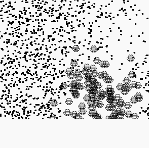   
另外每步演示的结果(egg)会存盘在根目根目录下，名为egg.ser，可以删除这个文件以从头开始新的测试。因为还没涉及脑模型的搭建，可以看到有些青蛙跑得飞快，这是自然选择的结果，因为跑在最前面的吃得多。   
一些重要的测试参数如显示区大小、是否每次测试要删除保存的蛋等，请参见Env.java中开头的常量设定，可以手工修改进行不同参数的测试。  
2019.03.21 添加了脑图，改进随机运动模式为Hungry区驱动。从脑图上可以直观地观察脑结构，方便调试。  
2019.04.01 改进脑图的显示bug, 每一次生成Frog时添加随机神经元，并简单实现"卵+精子->受精卵"算法，以促进种群多样性。  
2019-04-12 添加一个简单的眼睛(只有四个感光细胞)，自然选择的结果是眼睛被选中，但是和运动区短路了，谈不上智能。但有眼睛后找食效率明显提高了,见下图：  
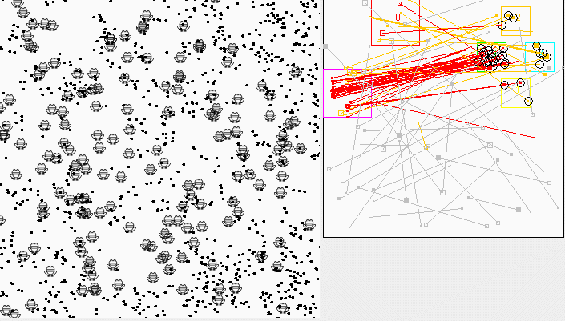   
2019-06-13 做了一些重构清理，加上了Happy和Pain两个器官，分别对应进食奖励和痛苦感，后者在靠近边界时激发。观查它的表现，痛苦感生效了，一些Frog跑到边界后就不再前进，而是顺着边界溜下去了，但是Happy器官没有生效，这也很显然，因为Happy属于复杂的进食条件反射链的一部分，在没有记忆器官（算法）引入之前，再怎么优胜劣汰也是没办法用上进食奖励信号的。见下图：  
    
2019-06-26 找食效率太低，又改回到4.12的用连接数量代替权值这个逻辑，人为设计的算法居然比不过随机连接。Pain器官的加入没有提高找食效率，必须与感光细胞合用才能知道是哪个边界，急需引入记忆功能。  
2019-06-28  为了让青蛙看到边界，又加了个新的眼睛，它是一个可自进化的nxn点阵的眼睛，将来会取代只有四个象素点(但能看得远)的老眼睛。到目前为止，依然还没有进行模式识别和记忆功能开发。另外脑图可以动态显示了，用一个红圈标记出被动态跟踪显示的青蛙。  
2019-07-28 有以下改动：  1.在Env区中间加了一个陷阱区Trap，以增加趣味性，自然选择的结果是青蛙会自动绕开陷阱区。2.增加一个Active器官，它的作用是一直保持激活，发现比Hungry器官驱动更能提高找食效率。3.增加一个Chance器官,它的作用是引入随机扰动，打破青蛙有时候围着一个食物打转就是吃不着的死循环。目前进食奖励信号没用到，白白浪费了。  
另外Chance和Eye类里也再次运用了随机试错原理去确定关键参数，效果还不错，有兴趣的可以看一看源码。  
   
另外发现青蛙其实是有记忆能力的，因为连接本身就是一种记忆，只不过它没有复杂的模式识别能力，例如给个蛇的图片它就认不出来。以后的工作将以模式识别为重点(当然随机连接看起来很有用，以后还可能保留)，基本原理是见note中提到的仿照波传播及全息存储原理，在思维区逆向成像。而且脑可能改成三维结构，并根据逆向成像原理，要将所有输入输出器官全移到三维结构的同一侧(即思维区)。这将会是一个非常大的改动，下面我简单画了一个3D示意图来说明我想象中的这个模式识别和记忆的原理，至于对不对还需要实验来验证:  
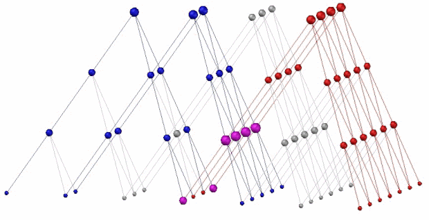  
这个模型的最顶层表示眼睛的感光细胞(或任意输入输出细胞)，同时也是思维区，红色表示一个长条的图形，兰色表示一个三角图形，如果这两个图形经常有规律地同时出现，就会把它们共有的节点撑大，见紫色的节点，当红色图形单独出现，就会强烈激活紫色节点，然后紫色节点的信号反向传播，就会激活三角图形，反之亦然。这就同时解释了模式识别和记忆(或者说回忆)功能的的原理。一个节点可以被多个感光细胞共享，所以它的存储能力是很强的。而且可能这个原理比较符合生物脑结构。当然，实际编程时，虚拟神经元不一定要排成正立方三角，而可能通过胡乱排放，大致上过得去就行了，也许能乱拳打死老师傅，最终要靠电脑自动随机的排放，然后用优胜劣汰来筛选。目前有个难点是这个记忆功能在思维区成像是如何有条不紊地大体上按串行进行工作的，这个问题先放一放。  
2019-08-04 更新了一个分组测试功能，如果测试青蛙数量太多，可以分批来测试，每轮测试最少的青蛙数量可以少到只有一个,这是用时间来换空间。  
2019-08-05 有了分组测试功能后，顺手加上了一个青蛙走跷跷板自动平衡的演示，它每次只出场一个青蛙, 每轮包括100场测试，大约跑90多轮半个小时(电脑慢)后，出现了下面的画面：  
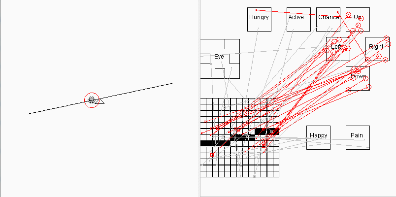  
这个版本的目的是为了增加一点趣味性，显得青蛙还是有点"用处"的，省得让人以为这个项目不务正业，青蛙只会找食。这个版本青蛙的脑结构和找食版的青蛙基本相同，区别只是在于环境不同，也就是说它的表现随着环境而变化，这符合"通用人工智能"的概念，即信号感受器官是统一的(通常是眼睛)，但能根据不同的环境完成不同的任务。走跷跷板演示是最后一个2维脑的版本，今后这个项目将沉寂一段较长时间，我将致力于将青蛙脑重构为3D金字塔形脑结构(见上文)，因为这个项目的缺点已经很明显，它不具备对2维图像的模式识别能力，用随机试错的方式只能处理非常简单的、信号在视网膜的固定区域出现的图像信号。  
青蛙的找食效率以及走跷跷板平衡的能力都没有优化到顶点，一些构想中的复杂的器官如“与门”、“或门”（不要怀疑大自然能否进化出这些复杂器官)等都没加上，器官的用进废退、奖励信号的利用都没反映，但我认为这些还不关键，目前最急迫的任务应该是先进行3D脑结构建模，让青蛙能具备2维图形的模式识别(和回忆)功能，这个大的架构重构是它能处理复杂图像信息的立足之本，它的图像识别能力和通常的用上千张图片来训练识别一个图片这种工作模式完全不同，它是一种通用的，可自动分类识别所有图像的模式，更符合动物脑的工作模式，记住并回忆出某个图像(或任意输入信号场景的组合)，可能只需要这种场景重复出现过几次即可，它是一种无外界信号判定，自动分类的识别模式。   
2019-09-09 开始3D脑的构建，任务又回到原点：找食，从静止的青蛙要能进化到吃光所有食物。目前只是搭建空的3D框架，还未涉及3D脑模型编程。新的工作存放在core3d目录，原有的旧core目录保留，相应地批处理文件也分为普通版run.bat和3d版run3d.bat,蛋文件也分为普通版eggs.ser和3d版eggs3d.ser。  
脑的3D版要引入模式识别功能，第一个编程任务是要用这个3D脑模拟出体全息存贮现象，也就等价于模式识别功能，用字母的点阵图像激活它的视觉区，并同时激活一个随意指定的脑区作为字母识别区，然后只激活视觉区的图像，再检查这个随意指定的字母区是否会被激活，而其它字母区基本不激活。体全息存贮在物理上很难实现，因为光和材料受物理特性制约，但在虚拟脑中不存在这个物理限制，让虚拟的光子反射、拐弯、增强、拆分都可轻易模拟出。        
反之，如果对应A字母的脑区兴奋，也要能激活一个模糊的A的像素点阵图像脑内某个区(与视网膜重合或下层)，这就是信息的检索和联想，这个联想功能以后会用到，由痛苦、愉快等奖惩机制来调节这个联想过程一直永无止歇地进行下去。  
2019-11-11 字母的模式识别功能  
这是切换到3D脑的第一个正式版本更新，它实现了ABCD四个字母的识别。测试时分别用ABCD四个字母，并同时加上一个声音信号，模拟体全息存贮。另外这个模式识别是双向的，如果只单单激活听力区，也会在视网膜区成像。（如果要演示这点，需要将LetterTester.java中的seeImage和hearSound两行注释互换一下，并去除Cell.java中的59和60两行，这两行代码的作用是阻止光子逆向传播到视网膜上)。以下是这个模式识别的截图，黑色的小点表示视网膜发出的视觉波信号，蓝色的表示耳朵发出的听力波信号：在它们交汇的地方，细胞象果冻一样，被波的载体（光子）砸出洞来，每当接收到新的光子，就有可能在旧的洞里砸出光子来并逆向传播，用红色小点来表示，最终在波源处逆向成像。这个工作原理在细胞级别将相关的信号关联起来，也是体全息存贮的模拟实现，可以在三维空间实现信息的高密度存贮:        
这个模式识别的原理比较简单，不需要任何高等数学知识，每个人都能看懂，而且它可能更符合人脑的工作模式，它可以进行图像到声音的关联，也可以实现声音到图像成像的逆关联，另外还有两个重要优点:1.它可以同时处理多维的信号，也就是说可以同时处理多个图片、声音等信号。 2.它的训练速度非常快，没有采用什么海量的大数据来进行训练，只要任意有关联的信号，哪怕信号只出现一两次，它都会自动将它们关联起来，这个关联是动物的条件反射能够建立的基础。        
有了模式识别，以后的工作就好办了。今后将在这个模式识别基础上进行扩展，进行多参数优化自动生成器官、声音的编码、把小蛇引入到虚拟环境等等一系列更复杂有趣的任务。   
2019-11-16 模式识别功能更新 
上次提交有个大bug，有多个字母出现时将不能区分，这次提交更正过来。到此为止，基本完成了模式识别的原理验证过程，即如果字母的象素点与训练图片的重点合越多，则听力区收到的反向红色光子数就越多，这是一个简单、直观的模式识别方法，以后可以通过将声音分成多个小区编码，并统计每个区收到多少反向的光子总数来判断是哪个字母图像输入。原理验证比较枯燥，但这个模式识别功能是无法绕过去的，一旦原理被证实，以后就可以有意地引导或者说设计青蛙向这个方向进化，而不是由手工来搭建包含模式识别功能的脑模型，因为一来要减少手工的干预,硬编码越少越好，尽量利用随机变异、生存竟争这个电脑工具，二来这个原理不光是模式识别要用到，其它信号处理（如快感、痛觉信号与行为信号之间的关联)都要用到类似的细胞级逻辑，因为我一直在强调“任意两个时间上相关的信号，大脑总会将它们关联起来，这是条件反射行为建立的基础”。    
另外，这次更新加强了暂停功能，可以在脑图任一时刻暂停，并加上了脑图的剖面显示。所有脑图快捷键有: T:顶视  F：前视  L:左视  R:右视  X:斜视  方向键：剖视  空格:暂停  鼠标操作：缩放旋转平移   
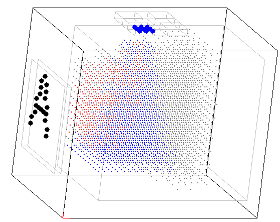   
2019-11-26 优化了一下程序，用"对酒当歌人生几何"8个汉字来进行模式识别原理演示，但容错性依然没有，变形、变位后的文字识别率很差。以后要考虑借签算法中的侧抑制、卷积、分层等原理来提高它的容错性，用图形化模拟的方式来实现。总体上算法和图形化模拟是两条路，算法通常可以用模拟的方式来表达，但不是所有模拟都可以归纳成算法，因为模拟(或者说软件本身)有时会非常复杂，不容易总结出规律。也就是说模拟的表现力比算法更强，但模拟的缺点是资源消耗大。   
2019-12-27 开始设立history目录，给主要的版本直接在history目录下创建副本，以方便运行。在history\003a_legs目录下（依然是2维脑)尝试给青蛙加两条腿，看它能不能自动学会走路。一条腿位于下方，负责左右移动，一条腿位于右侧，负责上下移动，每条腿有抬腿、落腿、转动和相应的感觉细胞。只有当腿落下且转动，而且另一条脚抬起来时青蛙才会位移，具体什么时候抬腿、什么时候转动腿完全由随机数决定。经过一段时间的生存汰淘之后，青蛙会进化出会利用两条腿走路了，但需要的时间非常长，约几个小时之后才达到最高吃食率50%左右，走路风格也比较诡异，是小碎步而不是大踏步。但至少这是青蛙第一次利用两条腿来走路，还是有点意义的，这证明生命进化中就算神经元随机排布，进化出眼睛和腿也是非常简单自然的事。这个实验只给青蛙加了两条腿，但同理如果有四条或更多的腿它应该也是可以随机进化出来的。   
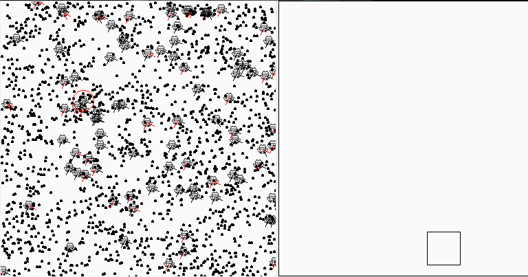  
2020-05-04 在进行3维脑改造过程中，发现找食率很低，自己也看不懂以前的程序怎么编的了，所以在history目录下又添加一个003b_simple目录，把2维脑简化一下，去掉不重要的器官，好分析它的逻辑。  
2020-05-07 经过一番折腾和走弯路之后，最后还是原汁原味地将2维脑003b目录的逻辑搬到了3维脑core目录里了，实现了同样的找食率(~50%左右)。从现在开始，可以专注于改进3D脑本身了。  
2020-06-26 小蛇吃青蛙  
位于history\006目录下，设定小蛇只能看到青蛙，青蛙只能看到蛇(严格说是蛇的舌头)。可以看到小蛇会追着青蛙，而青蛙会躲开小蛇，当然也有躲不开被吃掉的。除了引入负值连线用蓝色线条来表示外，技术细节上倒没有什么突破，但这个实验有趣的地方在于它证实了就算是完全随机的排列脑细胞，在长期的优胜劣汰后，生命也会进化出捕食和逃避行为。即然可以进化出捕食和逃避行为，而生命进化又会向越来越复杂的方向进化，所以这个原理可以解释为意识的萌芽了。高等生命的意识，本质上也无非就是大自然随机运动产生的一种复杂现象而已。
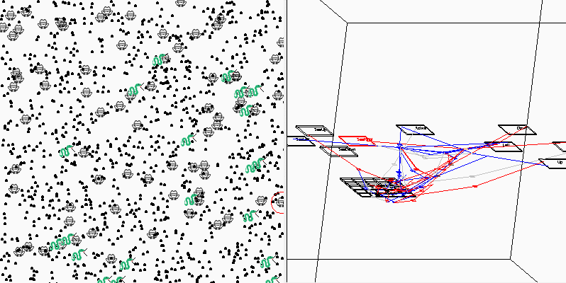  
下一步的工作将移回到体全息存贮的模式识别，因为青蛙需要这个模式识别功能来更好地分辨出蛇和食物的区别，而体全息存贮个人感觉有很多潜力可挖，它有两个最大的优点:一是可以小样本学习，二是可以同时处理多维的信息输入输出。  

2020-09-13  这次不是更新了，因为我最近太忙，所以先临时发布一个小开发任务，见下图，如果有兴趣的同学可以尝试一下看能不能做出来：  
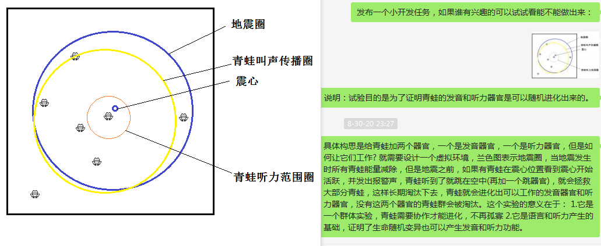  
说明：详见图片，通过模拟一个虚拟的环境来淘汰青蛙，只有当青蛙进化出能够在震心的位置发出叫声，其它的青蛙能听到这个叫声跳在空中躲避震波时，青蛙的生存机率才会变高，但是跳起来也会消耗能量，只有听到报警后跳起来才正好。如果这个实验能做成功，就可以证明生物即使脑神经元随机排列，也会进化出发音和听力器官，这是挺有意义的，因为这是一个群体进化，对于单个青蛙来说，进化出能叫，或是能听到声音对它自己是意义不大的，但是对于群体的生存有利，这个进化相当于是语言和听力的萌芽。整个虚拟环境的设定，就是要逼迫这种群体进化现象产生出来，个人认为是有大概率能做出来的。这里说进化出器官，不是变出来，而是模拟生物体偶然变异出了听力细胞和发音器官，这个是没问题的，问题的重点在于听力细胞和发音器官是如何在进化过程演变成脑神经网络的一个组成部分的。  

2021-01-23 语言的诞生。  
好不容易，告别漫长的2020，去年出的题目我自己解出来了，下面是答案，运行history\007_earthquake目录下的run.bat，可能看到类似下面的运行画面：  
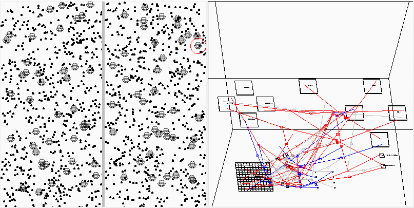  
详细解说：这个题目的模拟环境被简化成左右两个区，设定地震发生时（用红框表示）会扣除所有青蛙的能量，但是只有位于左侧的青蛙可以看到地震发生和停止，右区的青蛙不能看到地震发生和停止，但是青蛙有发音器官和听音器官，如果左侧的青蛙发出叫声是可以被右侧的青蛙听到的。看到地震发生、看到地震停止、发出叫声、听到叫声、跳起、落地这6个功能分别对应6种器官并都偶然进化出来(这个无需证明)，这个实验的目的是要验证青蛙会不会在环境逼迫下，在这6种器官对应的脑细胞间形成神经关联。结果可以看到，左侧的青蛙看到地震后，跳在空中（用黄色表示），并发出叫声，然后右侧的青蛙听到叫声后也跳在空中。左侧的青蛙通过叫声信号传递了信息给右侧的青蛙，从而让右侧的青蛙避开了它看不见的地震伤害。这是一个成功的群体进化的演示，它证明了即使是随机生成神经细胞连线，也可以进化出生物的发音-听力功能，也就是说进化出初步的语言功能。  
另外说一下，这个运行结果可能要运行多次才有可能遇到，这个可以用群友"背叛的细胞膜"提到的自然界的“顶端优势”来解释，生物进化有可能陷入局部最优解而绕不出来，对自然界来说就是没找到最优解的生物种群可能会被汰淘，存在即合理。  

2021-05-15 细胞分裂的演示    
这是我在微信群里发布的一个小任务， 还没来及更新到这里，群里的pama_1234就做出来了，编程速度不是一般的快，顺便说一下，他现在还只是高一，现在的后浪都这么历害了。
任务很简单，就是画出类似下图小蛇形状的就赢了。要求：  
1.小蛇至少30x30象素，有眼睛和舌头，反正一眼看上去要象一条蛇的样子。  
2.要求使用遗传算法和分裂算法，遗传算法大家都了解了。分裂算法我现在只有一个大致的思路，就是模仿细胞分裂，来演化出不同的形状。分裂可以是把别的细胞推开，也可以是只在边沿分裂以减少运算量，这个不限。  
3.画出“蛇”、“青蛙”的汉字也可以  
这个任务看起来和神经网络关系不大，但我觉得有可能利用这个算法来进行器官自动排布，所以还是有一定的意义的，任意复杂的形状生成，今后三维脑的细胞结构，都有可能从这个任务演化出来。  
输出结果（（pama_1234编写)：  
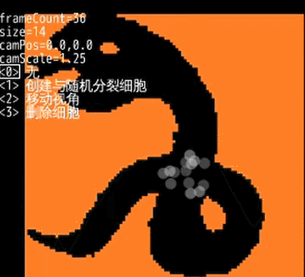  
他的项目位于这里：[细胞画蛇](https://gitee.com/pama1234/cell-painting-snake), 有兴趣研究源码的可以看一看，是基于processing编写的。  
顺便我把我的构思也写在这里，我没有仔细研究他的代码，但估计思路应该大体一致：  
1.与形状表达相关的基因采用多叉树结构数据结构，树结构是单例，只保存1份在内存中，每个细胞分裂后，端粒酶减一，相当于从树结构往下走一级。  
2.每个细胞分裂后，为了获得当前细胞的位置，但是又不能复制整个子树，所以要保存一个指针，指向树的当前节点，即子树的顶点。不再分裂的节点可以不保存节点指针。  
3.基因树总体稳定，但有大概率小变化，小概率大变化，基因树变化包括数量重复、分叉方向、分叉数量。  
4.因为是多叉树，可以从任意一点开始作为受精卵开始分裂，最后都可以形成指定的图形。  

画小蛇本身任务很简单，就是个填充色块的任务，用window里的画图笔刷不到半秒就可以搞定，之所以要把它当成一个任务来做，并限定用细胞分裂的方式，是因为大自然的解决方案不是用什么人为设计的算法，而是只有一招就是细胞随机的分裂、遗传和变异，现在看起来这个分裂模拟还是比较容易实现的，大致上解释了自然界生物各种形态生成的原因。  

2021-05-15 顺便发布下一个开发任务：青蛙吃蘑菇  
1. 青蛙要根据不同的画案区分有毒无毒的蘑菇。蘑菇用随机生成十种不同蘑菇图案来表示，这些蘑菇中有一半无毒，另一半有毒。
2. 要利用体全息存储或面全息存储方案来进行蘑姑图案识别。体全息存储参见005_letter_test示例；面全息存储方案可以参考激光全息存储方案，和体全息的区别是信息是保存在一个平面上，而不是一个立体间里，相同点是利用入射光和出射光位置信息进行存储和读取，入射光和出射光互为参考信号。
3. 要在现有的Java项目界面下进行，也就是说，要显示虚拟环境和脑图，源文件名必须为.java后缀。这个和细胞分裂的演示不一样，这个任务是项目的主线任务了。
4. 蘑茹有毒还是无毒是与图案相关的，但是有毒还是无毒必须由青蛙在进化过程中自动判断出来，不能由人为来设一个有毒的信号告诉青蛙(青蛙之间互传信号不在这个限制)。任务完成的标志是青蛙们要能进化成吃掉虚拟环境里的所有无毒蘑茹，避开所有有毒蘑菇。  

2021-07-04 依然是模式识别演示  
位于history\005a和005b两个目录下，分别演示利用改进版的体全息存贮方案和面全息存贮方案来进行模式识别。可以做到将25个任意图形和它对应的声音信号区关联起来：  
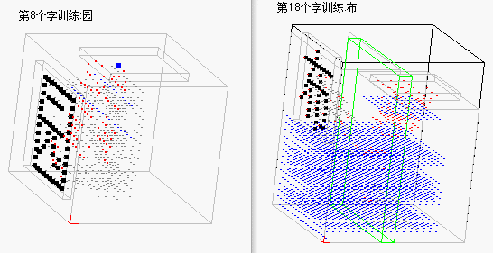    
这两个模式的基本原理是基于信号的反向传播，如果一个细胞的两个或多个不同方向同时(或短期内)收到信号，今后只要有一个信号传入，这个细胞将会向其它方向反向发送激活信号。这个模式识别原理非常简单，功能也比较原始，对于变形、扭曲、缩放、缺损的信号识别率很差，但考虑到实现这些功能的复杂性，我近期不打算进一步改进它了，而是打算另起炉灶，用三维空间的细胞分裂+遗传算法的模式，试试看能不能让电脑自动演化出具有简单模式识别功能的模拟生命体，也就是说实现上面发布的任务。    

2021-08-13 演示同时处理多个方向的信号  
位于history\005a1目录下，演示用5个声母和5个韵母的组合来关联到25个图像的识别，这样可以减少声音输入区的数量。它的另一个目的是演示体全息存贮的工作模式可以同时处理多个方向的信号。这个演示分辨率极差，只有约一半的识别率，但我不打算继续改进了。  
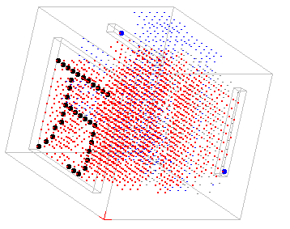    

2021-10-13 失败的细胞分裂尝试  
位于history\008目录下，这次本来想模仿生物细胞的分裂，从一个细胞开始分裂出任意指定的三维形状，并设计了split、goto等基因命令，但是做来做去做不出结果，细胞们就象跳蚤一样乱跑不听使唤，最终还是决定放弃，细胞分裂这个算法太难了。细胞分裂的优点是更“象”生物，而且估计可以利用分形原理缩小基因的长度，基因相当于一种自带循环和条件判断的计算机语言。  
最终生成三维形状这个目标还是借助简单遗传算法完成，通过细胞在相邻位置随机生成，并在基因里记录每个细胞的坐标的方式来实现，基因命令被删得只剩一个了，就是随机生成细胞。  
用遗传算法来生成任意形状，就好象一个画家在画画，但是画什么根本不知道，只知道听从旁边人打分，画的好就打高分，画的不好就打低分，这样一直循环下去，最终画的内容只由打分的人决定。目前速度上还有改进余地，比如让新细胞有更多变异率。  
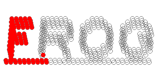  
生成三维形状目的是为生成三维脑结构做准备，神经网络空间上应该是三维的，这样实现模式识别会很方便，而早期随机连线结构损失了空间位置信息，三维全息演示问题则是它是手工设计的，优化困难。  

2021-11-08 成功的细胞分裂尝试  
位于history\009目录下，这次的细胞分裂算法采用自顶向下的策略，也就是从单个细胞开始，一个细胞分裂成8个(因为1个正方体切三刀正好是8个小正方体)这种方式来进行。这种方案不是从目标形状的局部开始填充，而是从毛胚、从目标的粗轮廓开始利用遗传算法细化，直到细化出每个细节。这种方案的优点是更接近生物实际，符合“从总体到局部”的正常逻辑，而且有高效的基因压缩存储率，为了说明存储率这点，大家可以看看下图左面这个树结构，猜一猜要存储它最少需要多少个字节?  
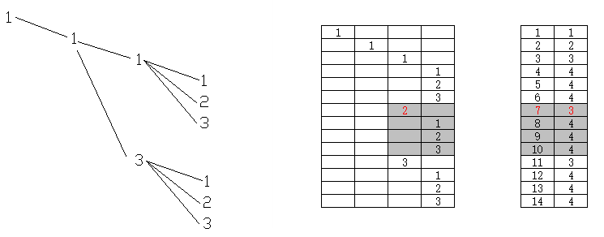  
答案是最少只需要一个整数7就可以表达这个树结构了。说一下原理：首先所有树结构都可以用行号+深度的方式来表达，详见我的博客[基于前序遍历的无递归的树形结构](https://my.oschina.net/drinkjava2/blog/1818631)，获取子树时可以避免递归访问，其次因为采用基因敲除的方式，只需要记录被敲除的树节点的行号和深度就就可以了，最后因为固定采用3叉树分形结构，所以深度值也可以省略，只用一个行号7就可以表达这整棵树了。  
下图是这个算法的动画，可以看出它与上次的演示是不同的分裂模式，是先有总体后有细节。项目中实际采用的是8叉树，深度用细胞边长表示:  
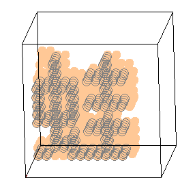  
细胞分裂算法一方面可以利用来生成和优化物理形状(比方虚拟风叶、翅膀、受力结构等形状)，另一方面它和神经网络的形成算法是有共通点的，因为众所周知心脏形状、血管网络、大脑神经网络都是由基因控制细胞分裂出来的。所以以后有可能利用这个算法来自动生成和优化神经网络触突三维空间分布结构。  
顺便说一下，自顶向下的问题是它一旦主分支被误敲除，就不容易补回去，实际的生物例子就是人眼结构还不如章鱼。自然界是用生物的多样化和环境的连续化来保证各种主分支都有尝试。我们电脑模拟要尽量保持环境(任务)的连续化，从低到高一步步走，个别时候考虑结合其它算法给错误的分支打补丁。  

2021-11-26 多参数的细胞分裂  
位于history\009a目录下，只是在上次细胞分裂基础上改进了速度，将三维cell对象数组改为long型数组，节省了对象创建和销毁开销，速度有明显改进。long类型有64位，所以一个细胞可以有64维独立参数，应该够用了。下图是一个6倍速显示的三维鱼分裂生成动图。它一共用到4维参数，分别是细胞的位置和三个不同颜色的细胞色彩参数，每一维分别一个细胞分裂算法单独控制，参数之间没有做关联关系：  
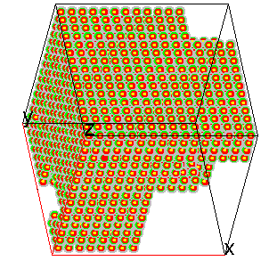  
这个动画的每一帧是细胞分裂到最小不可再分的最终结果，而且是从400个青蛙中生存下来的最佳个体，这就是遗传算法，遗传算法就是穷举法。这个16x16x16的大立方体要理解成第一个细胞，只是画的大了而已。以后等有时间可以做1个细胞分成8个，8个变64个的动画，能更好地演示分裂的中间过程。  
细胞分裂研究到此结束，下面要开始生成神经网络空间结构了。我的思路是，脑结构也无非就是三维细胞的空间排布而已，细胞有各种参数，比如触突长度、方向、密度、信号收发阀值、信号强度、信号遗忘曲线等，只要每个细胞不超过64个构造参数，就可以用分裂算法来随机试错把神经网络的空间结构给试出来。分裂算法的优点是遵循从主干到细节的生成次序，如果要完成的任务(即外界信号输入输出)也是从简单到复杂，就可能正好符合这个脑的空间结构生成顺序。  

2022-01-03 多参数的细胞分裂的小改进  
位于history\009b目录下，与009a分支相比，算法是相同的，只是作了以下一些小改动：  
1.可增加颜色 2.添加存盘选择框，可以在运行期选择存盘 3.添加每维参数分别显示的选择框 4.将颜色参数与细胞位置参数产生关联 5.新增了上次提到的显示分裂过程动画图,见下图：  
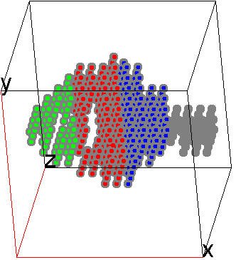  
因为参数之间有关联，更容易发生缺色现象，这是因为进化过程中，主要参数（细胞位置）的进化会导致次要参数的分支被误删，然后就很难再补回来了。为了解决这个问题，下一个版本打算改进算法，采用黑白节点的方式，黑节点删除节点以下的细胞，白节点保留节点以下的细胞。  
细胞分裂研究算法目前还不能结束(打脸自己)，还要先解决这个缺色问题。多参数的进化，如果一旦某个参数被误删除就不能再进化回来，这种算法是不能接受的。  

2022-01-15 多参数的细胞分裂继续改进：阴阳无极八卦阵算法  
位于history\009c目录下，采用了阴阳(黑白)节点算法，阴节点基因会删除节点下所有节点，是自顶向下的减材加工，阳节点基因会保留节点下所有节点，是自底向上的增材加工。利用遗传算法的大样本筛选，把自顶向下和自底向上两个进化方向结合起来，这样基本能解决误删分支后缺色不能补回这个问题。而且对于奖罚不再象以前一样要设成差距很大的值，animal.java中awardAAAA()原来要设成8000, 现在设成20也不会产生缺色现象。考虑到这个算法的特点，我给它起名“阴阳无极八卦阵算法“，阴阳是指它有阴阳两种节点，无极是指它的分裂阶数没有限制，八卦阵是指它采用了多个8叉树结构，每一维细胞参数都对应一个8叉树。

2022-07-22 树的生长演示  
位于history\010目录，演示一个树的生长。这个演示是基于规则而不是模板来生成一棵树，这棵树的形状仅由以下规则决定：  
1.树根位于底部中心  
2.树的每个细胞水平方向四周不能有其它细胞  
3.树的每个细胞正下方不能有细胞，但必须在斜下方至少有一个细胞  
基于这三条规则，利用阴阳无极八卦阵分裂算法，树能够自动进化出来。这个演示的意义是表示形状可以由规则来决定，不同的规则能进化出不同的形状，生物会通过改变自己的形状来适应环境规则。  
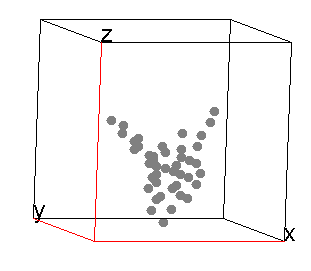  

2022-09-25 用阴阳无极八卦阵完成找食任务  
位于history\011目录，这是利用阴阳无极八卦阵算法来完成最开始的“找食”这个任务，即采用模拟细胞分裂再配合遗传算法，生成一个简单功能的神经网络，输入只有上下左右四种视觉细胞，输出只有上下左右四种运动细胞。  
为什么要使用阴阳无极八卦阵来生成神经网络，是因为它有几个特点：  
1.传统神经网络因为手工调优参数太多，被类比为”炼丹法“，而采用阴阳无极八卦阵之后，算法将只有固定的这一个，调参完全交给计算机，手工只需要设计基因和细胞行为即可，以不变应万变。只要有利于生存的脑结构，就会被筛选出来，结构即逻辑。  
2.有高效的信息存储方式(见先前8叉树的介绍)，基因虽然是随机生成的，但是它采用树结构这种方式有非常高的信息压缩比，可以用少量的基因控制巨量细胞的生成。  
3.更贴近实际生物的神经网络生成原理。大自然就是采用分裂+遗传算法来生成脑神经网络的，理论上我们可以应该照抄这个模式来创造出高智能的神经网络。  
4.它的神经网络是三维的，结构组合方式是无穷的。同一个细胞可以由多个基因控制，一个基因可能控制零个或所有的细胞。  
下面是实际运行结果，最上面一层用4种颜色来表示眼睛细胞，其余的细胞参数如运动细胞、轴突方向、轴突长度等用不同大小、颜色的圆来表示：  
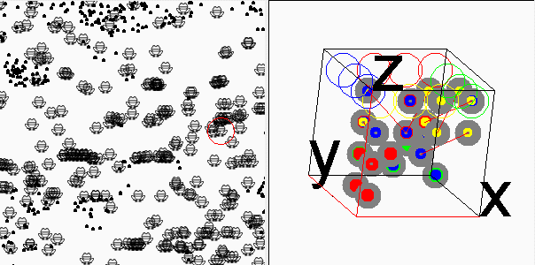  
这个版本的目的是验证阴阳无极八卦阵算法的实用性和搭建初步框架。后面的任务将是进一步复杂化，生成有模式识别功能的神经网络三维结构。  


## 运行方式 | Run
运行core或history各个子目录下的run.bat批处理文件即可启动运行，history下有多个子目录，按版本号顺序排列，存放着这个项目演化过程中的主要历史版本供演示。  
另外如果想要研究这个项目的早期版本，可以结合gitk命令和参考"版本提交记录.md"的介绍，用git reset命令回复到以前任一个版本，例如用:  
git reset --hard ae34b07e 可以转回到以前一个分组测试的找食版本。 码云上通常是大版本提交，跑出结果才会更新，github上则是日常提交。 

## 重要参数 | Parameters
在Env.java类中以下有以下可调整参数，请手工修改这些参数进行不同的测试，前4个参数很重要:  
```
SHOW_SPEED： 调整实验的速度(1~1000)，值越小则越慢。
EGG_QTY: 每次允许Frog下多少个蛋，通常下蛋取值在10~1000之间。蛋保存着我们测试的结果。实验的最终目标就是获得一批蛋。
FROG_PER_EGG： 每个蛋可以孵出多少个青蛙。  
SCREEN： 分屏测试，一轮测试可以分为多个批次进行，这里是屏数。每轮总的青蛙数量=EGG_QTY * FROG_PER_EGG, 每屏青蛙数=总数/SCREEN  
DELETE_EGGS: 每次运行是否先删除保存的蛋,如果设为false，将不删除保存的蛋，会接着上次的测试结果续继运行。 
SAVE_EGGS_FILE: 是否允许输出蛋文件到磁盘上
ENV_WIDTH: 虚拟环境的宽度大小，通常取值100~1000左右
ENV_HEIGHT: 虚拟环境高度大小，通常取值100~1000左右
FROG_BRAIN_DISP_WIDTH: Frog的脑图在屏幕上的显示大小,通常取值100~1000左右
STEPS_PER_ROUND: 每轮测试步数, 每一步相当于脑思考的一桢，所有青蛙的脑神经元被遍历一次。
FOOD_QTY：食物的数量，食物越多，则Frog的生存率就越高，能量排名靠前的一批Frog可以下蛋，其余的被淘汰。   
```
  
## 版权 | License  
[Apache 2.0](http://www.apache.org/licenses/LICENSE-2.0)  

## 期望 | Futures
欢迎发issue、评论等方式提出建议或加入开发组。另外在other目录下也可以上传你的文章、项目链接等资源。

## 关注我 | About Me
[Gitee](https://gitee.com/drinkjava2)   
[Github](https://github.com/drinkjava2)  
微信:yong99819981(如想长期关注本项目、或参与开发，请加我并留言"人工生命群")  