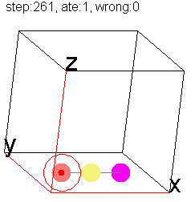
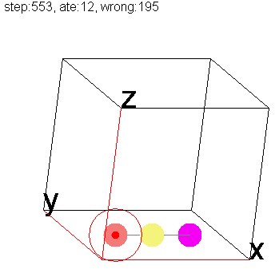
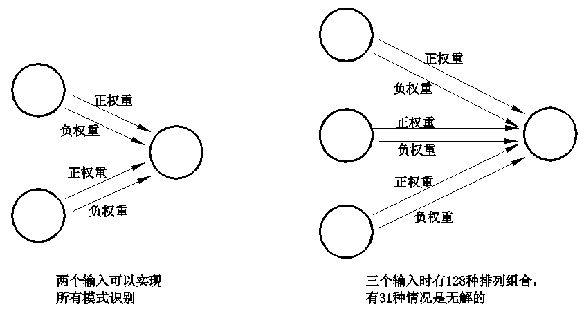

<p align="center">  </p>

## Frog | 人工生命 
这是一个人工生命试验项目，最终目标是创建“有自我意识表现”的模拟生命体。   

### 注：因README篇幅太长，2023年8月之前的内容已归档到[README1.md](README1.md)中了，如果第一次看到这个项目的网友，请先从[README1.md](README1.md)开始看。如果已经了解这个项目的，请接着往下看即可。


## 目前进展 
2023-08-25 三个细胞一台戏  
本次更新在目录history\014_3cells下。在上次更新里已经说过了，为了实现模式识别，可以先从最简单的几个细胞的场景开始做起。于是就一路简化，最终简化到只剩下三个细胞，分别为视细胞、咬细胞、忆细胞。 实验目的是要达到这样一个效果，当食物出现时，视细胞激活，然后视细胞在忆细胞上打个洞，咬细胞则随机激活，然后也在忆细胞上也打个洞，最终实现的效果将会是视细胞激活忆细胞，然后忆细胞在洞上反向发送能量给咬细胞，这样就实现了视细胞到咬细胞的短路，形成一个最简单的条件反射。忆细胞的作用是隔离视细胞和咬细胞，防止形成视细胞直接驱动咬细胞这种简单连接。任务看起来很简单，但做起来就不太美好了，快两个月了才有点进展，先更新上来再说。  
     
上面从左到右三个图，分别是对应三种场景下青蛙的行为：1奖惩值都很大；2奖励值远比惩罚值大；3只有奖励，没有惩罚。  
奖励是当咬下时正好有食物；惩罚是当咬下时食物不存在，咬了个空。测试时请修改Genes.java源码第138行，进行不同惩罚值的调整。可以看到，根据奖罚值的不同，三个细胞进化出的神经网络参数是不同的，奖惩值都很大时，细胞就会躺平，多咬多错，还不如不咬，以避免惩罚；奖励值远比惩罚值大时，细胞就会比较活跃，没有食物时也经常空咬；当完全没有惩罚时，细胞就会放飞自我，直接在咬细胞和忆细胞之间进化出信号循环回路锁定，全程都在咬，而且最过分的是干脆忽略掉视觉信号，把视细胞和忆细胞之间的连线（洞）直接用一个负值(蓝色)参数来掐断。  
这次更新的主角不是分裂算法(因为就三个细胞，谈不上结构了)，而是全局常量。本次程序中控制细胞特性的全局参数有7个，分别是：  
视细胞激活后产生多大强度的能量？  
咬细胞激活后产生多大强度的能量？  
每个细胞激活后能量随时间流逝，每一步会遗失多少能量？  
咬细胞激活后向记忆细胞传送多少能量？  
视细胞激活后向记忆细胞传送多少能量  
忆细胞激活后反向向视细胞传送多少能量?  
忆细胞激活后反向向咬细胞传送多少能量?  
这些全局参数是跟随青蛙终身的，一旦青蛙孵化出来就不再动了,在程序里把所有常量放在一个数组里，用遗传算法来控制，基本规则是小变动有大概率发生，大变动有小概率发生。青蛙的参数分为两类，一类是与空间位置相关的，如脑细胞是否会出现在某个空间位置，一类是与位置无关的，如每个细胞激活后向其它细胞发送多少能量。前者要放到分裂算法里，用一串8/4/2叉基因树来控制空间分布，后者就没必要这么浪费了，直接用一组全局数字表示即可，并用遗传算法来随机变异和筛选它们。在给神经网络编程时，如果碰到可以用全局常量来控制的参数，尽量不要手工赋值，而要用遗传算法来控制，因为多变量的优化组合筛选靠人力是不可能做好的。就拿这个例子来说，我压根不知道这些参数将会是多大，是正还是负，但是我知道应该有这些参数，这就够了。人工生命项目编程不讲究精准，思维模式要从传统的精细化编程转变为以概率、笼统、可能为导向的思维，大方向人为确定，细节交给电脑去算，这和大自然用遗传算法来筛选出脑细胞的参数是一个道理。  
从本次更新可以看到，青蛙是工作在一个连续的信息流下面，信息是以脉冲方式在细胞之间互相传递大小不等的能量,可以说是一个最简单的脉冲神经网络大脑了。这个实验不很实美，没有实现一个不漏地吃掉食物但是又不空咬这个目标，但是人生苦短，我不想继续和这三个细胞缠斗下去了，后面将转到多个视觉细胞和引入苦甜奖惩信号细胞来影响洞(权重)的大小，这个会更有趣、更智能，也更接近模式识别任务。我认为通用智能就是模式识别与行为输出结合起来的系统，如果奖罚细胞和行为输出细胞在一开始就做为这个模式识别系统的一个组成部分，并且由遗传算法来筛选参数，那通用人工智能就不远了。  

2023-08-25 关于XOR逻辑及多个输入的测试  
最近因为参数范围太大，很难跑出结果，想试试把忆细胞也简化掉，直接视细胞在咬细胞上挖洞，这样就成了单层神经网络，问题变成传统的单层神经网络实现模式识别，也就是说多个输入信号转化为更精简的输出信号。群里曾有人发过实现异或XOR逻辑需要一个中间层的图片，这有点复杂，我在网上搜了一下“实际脑细胞实现xor逻辑”，发现一篇文章“大脑只需单个神经元就可进行XOR异或运算”，按照它的原理，想了一下，在二个输入细胞、一个执行细胞，且每个输出都有正负两种权重的情况下是可以实现所有正常逻辑操作的，即AND、OR、XOR三个逻辑，这里面的小窍门是把累加高于1的饱和信号削除掉。“正常”指的是排除掉输入全为0输出为1这种看着就没什么用的逻辑。  
  
本次更新在015_testinput3目录下，只有一个TestInput3.java文件，这是个临时测试类，用穷举法来测试一个如果有三个视觉输入细胞、一个执行细胞的情况下能不能实现所有正常模式识别，即输入有2的7次方=128种组合，输出有0/1两种信号。实测发现这128种情况下有31种输入是无法通过调整权重来实现输出逻辑的，也就是说31种情况下是无解的。类似地，如果有4个输入，在32768组合中有29987种情况是无解的。所以如果输入信号大于两个时，必须改进结构，增加层数或在水平方向平铺增加输入输出细胞。  
目前有两个问题：一是用甜激素增加所有最近活跃的正权重、苦激素增加所有最近活跃的负权重这种方式能不能完全代替穷举法找到所有解；二是有没有办法只使用浅层神经网络实现模式识别？(人脑的皮层占了很大比重，顾名思义，皮层可能就是浅层的，而不是象深度学习一样是极深层的神经网络)，这个模式识别不需要很精准，能达到约15x15的分辨率就可以接近人脑的模式识别功能了，因为人脑还会结合动眼和变焦两个功能来缩小需要进行模式识别信号的像素。这两个问题目前深度学习可能能找到答案，但我不知道有没有人采用这种正负权重双通道输入的结构，这种双通道输入结构实际上才是实际生物的神经网络构成。  
 
2024-02-29 还是单点信号输入  
这个更新在history\016a_OneInput目录下，实现当只有一个视信号输入时，咬细胞随食物出现激活，食物消失停止激活，这是个最简单的逻辑。这个实现还是使用连线算法来模拟触突，因为细胞少时，连线算法编程更方便一点，连线算法是以连线的绝对坐标来定位，分裂算法是以相对每个细胞的相对坐标来定位。本次更新中，有一个视细胞，一个甜味感觉细胞，一个苦味感觉细胞(咬错时激活)，一个活动细胞(始终激活），和几个空白细胞。随机连线的参数是在常量随机数组上随机截取一段，这次引入了分组功能，把每种连线给一个编号，每个编号相同的连线拥有相同起始位置的一串固定参数，固定参数是指一旦生成就不再改变的参数。可变参数如权重等需要在运行期为每个连线上的参数分配一个内存。固定参数不管有多少，每个连线只需要给一个编号即可，可以节约内存。这个类似生物脑，可变参数不在基因里保存，因为可变，出生时是空白的，也就不需要占用基因位来存贮。一串固定参数可以简化成一个编号，然后编号们又由分裂算法来控制，海量的细胞可以用很少的字节数来控制，这就是为什么人类有100亿个不同位置和功能的脑细胞但基因信息量却只有850MB的原因。  
下一步计划是2点、3点、4点线性信号模式识别，2x2、3x3二维信号模式识别, 一点一点向上实现，大的图像将引入动眼和变焦细胞。  
从2点开始，可能引入饥饿细胞，在饥饿状态下，青蛙会有更多随机试咬动作，以增加形成正确条件反射的机率。当然以后随着模式识别复杂化，就算青蛙都饿死也很难触发正确的随机动作，就要考虑引入人为的训练信号了。  

2024-05-30 失败的两点信号输入  
这个任务打算用连线算法实现2点信号输入，但做起来感觉很累，一想到以后还必须将它改成分裂算法，而且连线算法有天然的缺陷（所有线条没有节点轻重之分，很难实现突变)，所以决定放弃，把内容拷贝到hisgory\016b目录下备份，有兴趣的网友也可以试着用连线算法做一下，反正我是放弃了。  

2024-06-20 还是单点信号输入，用分裂算法  
在目录history\016c_OneInput目录下，用分裂算法实现单点信号识别，即在单点视觉信号、咬细胞、张嘴细胞、甜味细胞、苦味细胞之间通过自然进化形成神经关联。宏观上实现的逻辑很简单，就是有一只大嘴怪呆在水里，看到食物就咬，食物消失就把嘴张开继续等。绿线表示咬对了，红线表示咬错了。  
因为要用细胞分裂算法实现更复杂的模式识别，单点信号的识别是绕不过去的，顺手先把这个做出来。  
技术上为了加快速度，这个版本把它的所有脑细胞都排成一条线，即使用前面的阴阳2叉树分裂算法。每个细胞用到24位基因，前16位表示它与其它16个细胞之间有没有连线，后面一些基因定义细胞的类型，不同类型的细胞有不同的行为。注意这个版本中眼睛嘴巴对应的脑细胞位置和数量并不固定，而是由分裂算法决定如何在空间分布。  

 
## 运行方式 | Run
运行core或history各个子目录下的run.bat批处理文件即可启动运行，history下有多个子目录，按版本号顺序排列，存放着这个项目演化过程中的主要历史版本供演示。  
另外如果想要研究这个项目的早期版本，可以结合gitk命令和参考"版本提交记录.md"的介绍，用git reset命令回复到以前任一个版本，例如用:  
git reset --hard ae34b07e 可以转回到以前一个分组测试的找食版本。 码云上通常是大版本提交，跑出结果才会更新，GitHub上则是日常提交。   
更多关于项目源码的介绍可以参见other目录下的"初学者入门介绍.md"以及history目录下的项目文档。  

## 重要参数 | Parameters
在Env.java类中以下有以下可调整参数，请手工修改这些参数进行不同的测试，前4个参数很重要:  
```
SHOW_SPEED： 调整实验的速度(1~1000)，值越小则越慢。
EGG_QTY: 每次允许Frog下多少个蛋，通常下蛋取值在10~1000之间。蛋保存着我们测试的结果。实验的最终目标就是获得一批蛋。
FROG_PER_EGG： 每个蛋可以孵出多少个青蛙。  
SCREEN： 分屏测试，一轮测试可以分为多个批次进行，这里是屏数。每轮总的青蛙数量=EGG_QTY * FROG_PER_EGG, 每屏青蛙数=总数/SCREEN  
DELETE_EGGS: 每次运行是否先删除保存的蛋,如果设为false，将不删除保存的蛋，会接着上次的测试结果续继运行。 
SAVE_EGGS_FILE: 是否允许输出蛋文件到磁盘上
ENV_WIDTH: 虚拟环境的宽度大小，通常取值100~1000左右
ENV_HEIGHT: 虚拟环境高度大小，通常取值100~1000左右
FROG_BRAIN_DISP_WIDTH: Frog的脑图在屏幕上的显示大小,通常取值100~1000左右
STEPS_PER_ROUND: 每轮测试步数, 每一步相当于脑思考的一桢，所有青蛙的脑神经元被遍历一次。
FOOD_QTY：食物的数量，食物越多，则Frog的生存率就越高，能量排名靠前的一批Frog可以下蛋，其余的被淘汰。   
```
  
## 版权 | License  
[Apache 2.0](http://www.apache.org/licenses/LICENSE-2.0)  

## 期望 | Futures
欢迎发issue、评论等方式提出建议或加入开发组。另外在other目录下可以提交你的文章、项目链接等资源。另外也欢迎给项目捐助，这可以加快项目的开发速度。  

## 关注我 | About Me
[Gitee](https://gitee.com/drinkjava2)   
[GitHub](https://github.com/drinkjava2)  
微信:yong99819981(如想长期关注本项目、或参与开发，请加我并留言"人工生命群")  