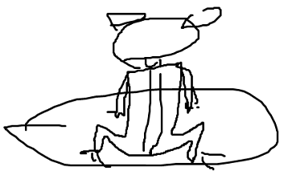
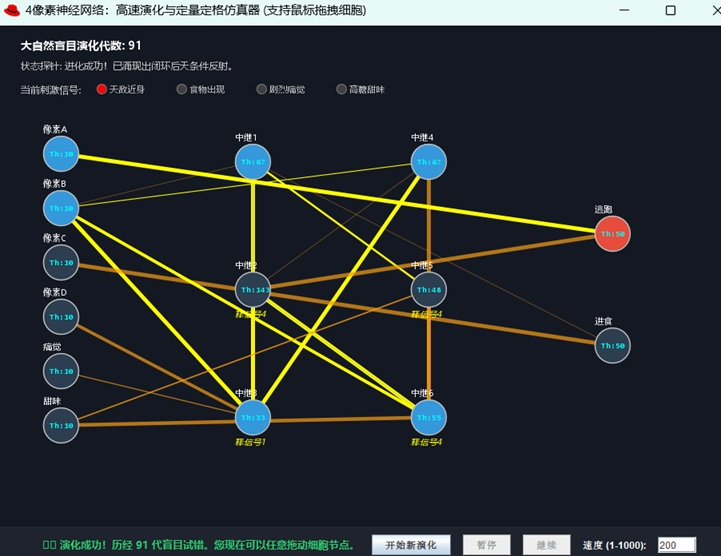

  

## Frog | 人工生命 
这是一个人工生命试验项目，最终目标是创建“有自我意识表现”的模拟生命体。   

### 注：因README篇幅太长，2026年之前的内容已归档到[README1.md](README1.md)和[README2.md](README2.md)中了，如果第一次看到这个项目的网友，请先从[README1.md](README1.md)开始看。如果已经了解这个项目的或者觉得只吃最后一个烧饼就能吃饱的，从本篇接着往下看即可。

## 目前进展 
2026-06-22  利用AI整理思路和编程  
上个版本017版因为一直思路不清，放弃。这是第018版。从本版开始利用AI（Gemini)进行思路分析和编程。  

当前的目标是如果一个模拟生命具有两个像素点的视觉信号，还有咬细胞、松口(或逃跑)细胞、甜味细胞、苦(或痛)细胞，要让它利用自然进化(最好是细胞分裂算法)，实现看到代表甜味食物的视觉信号就咬下，看到代表苦味食物(或天敌)的视觉信号就松口(或逃跑)。这个看似非常简单的问题困了我两年(实际上是对脑科学了解太少，脑子太笨，思路有限)，最近我决定不再闭门造车，直接问问AI，看看它是怎么实现这个逻辑的，而AI的回答也比我想像的要复杂的多，引入了杏仁核、纹状体、去甲、刹车、皮抑、LTP等多个概念。因为AI是基于实际生物的脑神经原理来回答的，虽然我觉得繁琐了点，但它的回答对应了现实，而且总比我一直啥也憋不出来好，所以就把它的答案和它的编程放上来，因为问答过程多，详细记录可以参见record目录下的原始问答记录，这里只简述主要的问答过程和AI编程结果：  

首先问AI“按时间顺序，把完整的逃跑条件反射和咬下条件反射形成过程，用文字描述，要具体到最少数量的细胞、触突、介质并用代号代表”。经过一系列反复，AI总结出以下细胞级别的条件反射形成流程：  

一、 防御逃跑条件反射（恐惧学习）连线图  
C1: 粗视 ───► [ S5 突触 ] (NT: 谷氨酸 / 快速预警) ───► C9: 逃跑  
C2: 精视 ───► [ S2 突触 ] (默认高阻断 / 后期被去甲加固) ───► C7: 杏仁核  
C4: 痛觉 ───► [ 本能防御双线通路 ] (强兴奋信号) ───► C9: 逃跑  
C4: 痛觉 ───► [ 痛觉侧支通路 ] (触发放电) ───► C5: 去甲  
C5: 去甲 ───► [ 调制投射通路 ] (NT: 去甲肾上腺素 / 催化LTP) ───► [ S2 突触 ]  
C6: 皮抑 ───► [ 门控刹车通路 ] (NT: GABA / 日常抑制) ───► C7: 杏仁核  
C7: 杏仁核 ───► [ 冲锋通路 ] (冲破刹车后的强信号) ───► C9: 逃跑  
C9: 逃跑 ───► [ 运动神经轴突 ] (驱动肌肉) ───► 最终逃跑行为  
二、 捕食进食条件反射（奖赏学习）连线图  
C2: 精视 ───► [ S1 突触 ] (默认关闭 / 后期被多巴加固) ───► C8: 纹状体  
C8: 纹状体 ───► [ 动作执行指令通路 ] (强信号) ───► C3: 捕咬  
C10: 多巴 ───► [ 奖赏投射通路 ] (NT: 多巴胺 / 物理绑定) ───► [ S1 突触 ]  
C11: 甜味 ───► [ 本能捕食双线通路 ] (强兴奋信号) ───► C3: 捕咬  
C11: 甜味 ───► [ 奖赏激活侧支 ] (同步报告甜头) ───► C10: 多巴  
C3: 捕咬 ───► [ 运动神经轴突 ] (驱动咀嚼肌) ───► 最终撕咬吞咽行为  

为了编程方便，再进一步对AI要求：标记出细胞间天生的关联，加上初始值，标记出每次权重调节量的数值，标记出激活后的轴突输出值，以及汇总树突后总的细胞激活阀值，逻辑图变成如下：
：  
逃跑条件反射流程：  
C1: 粗视 （Th: 10 / Out: 100） ───► [ S1 突触 ] (H1: 谷氨酸 / 天生 / 初100) ───► C12: 惊跳本能 （Th: 10 / Out: 100）  
C12: 惊跳本能 ───► [ T3 试错开关 ] (天生，可调 / 初0 / 单次+100) ───► [ S2 突触 ]  
C3: 精视 （Th: 10 / Out: 100） ───► [ S2 突触 ] (默认高阻断 / 后期被去甲加固) （天生，可调 / 初0 / 单次+100） ───► C4: 杏仁核 （Th: 80 / Out: 100）   
C5: 痛觉 （Th: 10 / Out: 100） ───► [ S3 突触 ] (本能防线 / 天生 / 初100) ───► C2: 逃跑   
C5: 痛觉 （Th: 10 / Out: 100） ───► [ S4 突触 ] (痛觉侧支 / 天生 / 初100) ───► C6: 去甲 （Th: 10 / Out: 100）  
C6: 去甲 ───► [ T1 调制点 ] (H2: 去甲 / 天生，可调 / 初0 / 单次+100) ───► [ S2 突触 ]  
C7: 皮抑 （Th: 0 / Out: 100） ───► [ S5 突触 ] (H3: GABA / 天生，可调 / 初100 / 单次-100) ───► C4: 杏仁核  
C4: 杏仁核 ───► [ S6 突触 ] (冲锋通路 / 天生 / 初100) ───► C2: 逃跑  
C2: 逃跑 （Th: 50 / Out: 100） ───► [ S7 突触 ] (运动轴突 / 天生 / 初100) ───► 最终逃跑行为  

进食条件反射流程：  
C13: 嗅觉/探究 （Th: 10 / Out: 100） ───► [ S13 突触 ] (香气引诱 / 天生 / 初100) ───► C14: 趋向/探索 （Th: 50 / Out: 100）  
C14: 趋向/探索 ───► [ S14 突触 ] (触碰咬入 / 天生 / 初100) ───► C9: 捕咬  
C3: 精视 （Th: 10 / Out: 100） ───► [ S8 突触 ] (默认关闭 / 后期被多巴加固) （天生，可调 / 初0 / 单次+100） ───► C8: 纹状体 （Th: 60 / Out: 100）  
C8: 纹状体 ───► [ S9 突触 ] (动作指令 / 天生 / 初100) ───► C9: 捕咬  
C10: 多巴 （Th: 10 / Out: 100） ───► [ T2 调制点 ] (H4: 多巴胺 / 天生，可调 / 初0 / 单次+100) ───► [ S8 突触 ]  
C11: 甜味 （Th: 10 / Out: 100） ───► [ S10 突触 ] (本能捕食 / 天生 / 初100) ───► C9: 捕咬  
C11: 甜味 ───► [ S11 突触 ] (奖赏激活侧支 / 天生 / 初100) ───► C10: 多巴  
C9: 捕咬 （Th: 50 / Out: 100） ───► [ S12 突触 ] (运动轴突 / 天生 / 初100) ───► 最终撕咬吞咽行为  

然后根据以上细胞逻辑图，就开始让AI编程实现这个逃跑反射和进食条件反射流程的模拟，并用细胞间随机联线模拟大自然进化的方式来进行，让电脑自动进化产生一个能够自动进化出逃跑和进食条件反射的虚拟生命，从AI问答3一直到问答6，基本实现了一个这样功能的虚拟生命产生和测试的程序，而且视觉像素点改成了四个。这个程序还不完善，触突和化学元素标记不清，以及没有严格按照上面流程图中的元素来进化,不知为什么省掉了杏仁核等元素而是采用了中间细胞的方式，也没用到我心心念念的细胞分裂算法而是用的随机连线算法，但是至少这是第一个在电脑里进化出来功能比较完备能够根据视觉信号结合痛苦信号形成逃跑条件反射、根据视觉信号结合甜味信号形成进食反射行为的虚拟生命，所以先更新上来，以后再慢慢改进，比如以后要加入正确形成条件反射后信号流传递的细胞级演示。目前源码在core目录里，为了方便向Gemini提交源码，目前所有源码都挤在一个文件里了，运行界面如下：  
   

顺便说一下，人工生命如果只研究它的智能和进化，就是在研究人工智能，这个项目的基本思路就是从最低级的人工生命智能的条件反射形成，不断增加视觉和行为输出复杂度，最终实现高度复杂的人工智能，所以从一开始就要让它具备自进化功能，不能人为设计它的脑结构，否则任务变化而它的脑结构却不变，就偏离了利用人工生命（主要是细胞分裂算法和遗传算法)这个能够自动进化脑结构的工具来研究智能的方向了。  
再顺便说一下，因为项目侧重于简单的底层研究，目前用AI编程还是比较方便的，到目前为止我没有手敲一行代码，有兴趣在电脑里研究人工生命的但又不会编程的，现在也可以尝试一下用AI来编程了。

 
## 运行方式 | Run
运行core或history各个子目录下的run.bat批处理文件即可启动运行，history下有多个子目录，按版本号顺序排列，存放着这个项目演化过程中的主要历史版本供演示。  
另外如果想要研究这个项目的早期版本，可以结合gitk命令和参考"版本提交记录.md"的介绍，用git reset命令回复到以前任一个版本，例如用:  
git reset --hard ae34b07e 可以转回到以前一个分组测试的找食版本。 码云上通常是大版本提交，跑出结果才会更新，GitHub上则是日常提交。   
更多关于项目源码的介绍可以参见other目录下的"初学者入门介绍.md"以及history目录下的项目文档。  

  
## 版权 | License  
[Apache 2.0](http://www.apache.org/licenses/LICENSE-2.0)  

## 期望 | Futures
欢迎发issue、评论等方式提出建议或加入开发组。另外在other目录下可以提交你的文章、项目链接等资源。  

## 关注我 | About Me
[Gitee](https://gitee.com/drinkjava2)   
[GitCode](https://gitcode.com/drinkjava22222/frog)  
[GitHub](https://github.com/drinkjava2)  
微信:yong99819981(如想长期关注本项目、或参与开发，请加我并留言"人工生命群")  