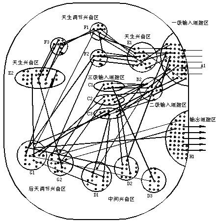

## 一个人工脑模型 
(摘自2002年的[造人论坛](https://zhangrex.neocities.org))
最近我草构了一个人工脑模型，其中除了具体细节实现没有外，我认为这个模型基本上能够模拟人脑的工作原理，同时也试图想从这个模型来解释"意识"、"语言"是什么。因为这个模型完全是我凭感觉想出来的（我以前买过一本神经网络算法的书，但至今也没看懂什么叫BP算法），必然有许多不完善之处，但愿我这个外行的抛砖引玉，能给研究神经网络人工智能的专们一点启示，相信今后会有更多更好的模型提出来。之所以我不给出这个脑模型的基本单元--神经元的细节，是因为一方面我觉得如果总体方向把握对了就行了，实施细节可以让做学问更严谨的模式识别、神经网络专家们来研究。另一方面，我也不认为一定要采用上亿个简单神经元的方式来实现这个人造脑，关键是实现这个模型所表述的逻辑，也许夹杂用一些复杂点的单元（如一个单片机代表的微系统）作为这个模型的部分最小组成部分，可以更好地实现它的逻辑，总之，能逮着老鼠的就是好猫；再一个原因是，大家一直认为哲学上、纯理论上的研究是人工智能的瓶颈，我却不这样认为，对于一个口号就是“我思我不在”的人来说，意识的本质之类的研究根本就是很简单和无聊的，就好象一大群人在研究"透明"到底是什么一样。相反我认为人脑的总体（哲学）理论很简单，但要从细节上实现它却非常难，一方面是目前在神经网络模式识别方面的研究水平较低，另一方面是大家还缺少以实验为导向的习惯。我认为其实研究神经网络的最简单的步聚就是：一、同不同意神经网络可以造人？二，如果同意，就将所有研究神经网络的资金人力全部转到这个方向，因为造人导致的生产力促进意义（及风险规避的意义）超过任何研究。既然已经开始研究神经网络而不研究造人简直是手握着金碗讨饭!(个人看法) 三、如果开始研究造人，将10%的研究资源放在模型理论研究上就足够了，90%的研究资源放在物理实理和逻辑细节实现方面。通过构造一个系统，观察它的输入输出（应激性），改进它，再观察......直到它的表现和人类似为止就算大功告成了。四.在没有大功告成之前考虑一下："研究怎样造人，并不是为了造人而造人,而是未雨绸缪，防止技术的进展超越人类控制技术的能力。  
一个人工脑模型：  
A：一级输入细胞区  
特点：外界刺激直接导致此类区域细胞兴奋，不可逆，即其它类区域神经兴奋不会导致此类区神经兴奋。  
对应人的一切与外界直接作用的感觉细胞，如视网膜细胞、与耳膜相连的细胞、触觉（包括痛、痒、温度等）细胞、味蕾细胞等。  
B：二级输入细胞区  
特点：固有的神经网格处理区，A区的信息在这个区域被加工。  
A类区域的兴奋将有通常有上万个神经元同时兴奋，对于不同模式将有不同的B类区域兴奋，此B类区域将感觉进一步细化，如A类区域视神经区兴奋后将导致B类区域的图形区（线条、形状）、颜色区（红区、黄区、蓝区......）兴奋，A类区域触觉区兴奋可导致B类的痒区、痛区、酸区等兴奋；A类声波感受区兴奋将导致对应不同单词的B区兴奋，如对应"我"、"你"不同的声波，将产生对应不同的B区的兴奋。  
C：三级输入细胞区  
特点：此区细胞由一群与若干B类区域相连的空闲细胞转化而来。一组B类区域兴奋将导致某个C类区域兴奋，B与C之间的联系是后天形成，并在一定程度上可受内部其它神经元影响。  
例如："我"这个字的声波信号可导致A类区域的所有声音兴奋，但只有一个对应"我"的B1区域兴奋，"们"这个字的声波信号可导致A类区域的所有声音兴奋，但只有一个对应"们"的B2区域兴奋，如果有一个区域位于B1与B2之间且"我们"而个字经常重复出现，则在这个区域里逐渐形成一个与B1和B2相联系的兴奋区C1，只要B1"我"、B2"们"中的任一个细胞兴奋，都可使C1区兴奋，但只有"我们"同时出现时，C1区的兴奋达到最大值。也就是说，"我们"这两个字的声波已经转化为清晰的特定细胞区兴奋。（这是人脑能理解语言、文字、手势、表情等信号的关键原因，因为一切复杂的信息输入最终者简单地上升为一个特定的C类区域兴奋。  
注意，这里只是说到反复说"我们"两个字将产生对应脑中"我们"的C区兴奋，但"我们"这个区域兴奋并不代表这个脑能理解"我们"的含义。如果经常对一条狗喊"我们来了"，然后给它吃骨头，以后狗只要一听到"我们"这两个字的声波，就以为是骨头来了的意思。  
D：中间兴奋区  
特点：这个区域占据脑的大部分，它的特点是大量神经细胞群连系于B类区域和C类区域之间，并互相间连接，且连接方式和强度是可调的，在没有外界输入信息时，D类区域中的互相连接完全没有，但只要一出现有规律的任意两个或多个B、C、D类区域兴奋，将会在空闲的D类区域中产生一个对应的兴奋区。实际上C区与可算是D区的一个子集，C区比D区简单，C区的形成是因为若干B区域的兴奋，而D区域的形成原因可以是若干其它D区域的兴奋。  
所有的复杂但有规律的外在信息输入，最终都将沉淀为某个D某区域的兴奋。这时里的"有规律的信息输入"包括场景、语言、图画、文字、手势、表情等信息。人们通常并不在意日常接触到的信息都是有规律的，而事实人生活在一个现实的世界中，它的一切现象都是有稳定的内在规律的，正如人们看到的地平线总在眼睛下方而从不跑到头顶上方。神经网络最擅长的工作特性之一就是将不同的有规律的信号从同时出现的大量信量中筛选出来，这是一个并行处理过程。正因为世界有规律，而人脑能筛选出这些规律，人才能适应这个世界的规律而生存下来。世界上任何一个物体包含的信息量都是无穷的，不同的宏观微观角度观察同一个事物得到的信息是不同的，明显又可观察的信息量只占它的极小一部分。正如数轴上任一段区间无理数的数量都大于整数的数量一样。人的思维往往会简化世界，正是因为人脑的输入器官只能断章取义地获得极少量的关于周围世界的信息，但辛运的是这一点信息对于人能够生存下来已经够了。  
下而举例说明人脑是怎样建立起"我们"这个概念的：小孩从小到大，经常会听到"我们"两个字连在一起的声波（"我们"的声波引起A1区所有听力细胞兴奋，"我们"这个声波规律在C区被处理成对应"我们"的C1区兴奋），当小孩听到"我们"这个声波时，往往他已经处在一群人中间，（"一群人"D1区、"我"D2区、"在......中间"D3区等区域兴奋），多次反复后，联系在"我们"C1区、"一群人"D1区、"我"D2区、"在......中间"D3区中间的空闲区D4中形成了与这几个区的连接，今后只要这几个区域中的任一个兴奋，都可能引起其它几个区的兴奋。记忆的本质就是空闲的D区变为不空的过程。  
从上而的分析中可以看出，语言同其它的输入信息一样，都是外在规律在人脑中的沉淀，但语言还是有它非常特别的地方，为什么呢？还是举个例子来说吧：如果一个没有听过"汽车"的母亲独自扶养大一个小孩，则小孩长大后首次听到"汽车"这个声波信号将不会有任何反应。如果一个知道"汽车"的母亲独立扶养一个小孩，母亲肯定会经常对小孩说："汽车有轮子，会跑"，这样，尽管小孩没有直接接触过汽车，但汽车的特性规律还是沉淀在了他的脑中，因为他直接接触到的有"轮子""跑"这样的概念，并分别对应"轮子"的D1区兴奋和"跑"的D2区兴奋，如果经常通过母亲的嘴巴传出"汽车""轮子""跑"三个声波连在一起出现，则将会在D1和D2区中间产生一个D3区对应汽车声波，今后只要三个区中任一个兴奋都可能导致另两个区兴奋。这就是语言的特点，它缩短了建立新的D3区的时间，通过语言，人们不必要在听到"汽车"这个声波的时候，亲眼看到"轮子"和"跑"就可以快速地建立这个联系了。意识是自然规律在人脑中的沉淀，而语言则可以将这种沉淀"拷贝"到别一个脑中。人类文明的开始就在于语言的出现，因为从这时起，以前只能为个人意会而无法表达的对自然的规律的认识可以一代代地"拷贝"下去了。  
E：天生的兴奋区  
特点：这个区域的兴奋与否取决于机体对特定的输入信号产生兴奋，是一种先天固有的兴奋，此区的兴奋多数属于B类子集，如甜、苦、痛、痒、饿等兴奋，也包括一些特定的内部信号如人脑中对毒品、激素会起兴奋作用。  
F：天生调节兴奋区。  
这个区域是人脑在长期进化过程中形成的，如果这个区域兴奋，将会对其它调节兴奋区的联系强度起影响。举例来说，小孩看到刀子，用手去模，被割痛，缩回手，以后不敢用手摸刀。这个反射链的建立过程：  
过程一：.A类视网膜细胞兴奋 B类硬、亮、长、扁区域兴奋；C类"刀子形状"区兴奋  
过程二：D类"没见过"区、"好玩"区兴奋，G类"好玩没见过要摸"区兴奋 H类伸手细胞兴奋 A类手位变化感觉细胞兴奋；  
过程三：A类触觉细胞兴奋 B类冷、硬、红、曲线、动区兴奋 C类痛区、"流血区"兴奋 E类痛区兴奋；F类手痛要缩手区兴奋  
过程四：H类缩手细胞兴奋小A类手位变化感觉细胞区兴奋；B类不痛区兴奋 D类新增"刀子形状导致痛"  
程四：G类新增"缩手就不痛"区  
G；后天调节兴奋区  
在E中已经提到了G类区域，它与E区的共同点是如果此区兴奋，将会导致其它调节区F类或G类的联系发生变化，或是产生新的G区。  
它与D区的共同点在于G类兴奋区在系统刚开始时，没有任何G类区域存在，而是逐渐在后天形成的。  
意识的本质是条件反射，最原始的条件反射是先天的F类兴奋区决定的条件反射。但后天的因素也会改变这种反射，从这个脑模型的角度来说就是G类区域兴奋可对F类区域的反射强度加以调整。例如手被割将会缩手是先天的F类区形成的反射，但人长大后也可以做到手被割而不缩手。这是因为F类反射被G类反射抑制的原故。另一个例子是毒品产生的E类兴奋会形成人脑内新的G类反射，会抑制正常的G类和F类反射，从而吸毒者有可能做出为了吸毒这样无意义的事而摧残身体的行为。  
H：输出细胞区  
特点：此区细胞兴奋直接导致系统对外界作出反应，相当于外设。也可以细化为一级、二级输出细胞区，但相对于输入细胞的数量和复杂度，输出则简单得多，就不再作进一步的探讨了。  
一些通用内部规律：  
一． 各类区域逻辑上有区分，但实现结构上是互相穿插紧密相连的，或是不能简单区分。  
二． 各区域由若干并行工作的最小单元组成，各区域及单元间互相联接。足够的数量保证任意两个区域兴奋都能找到一个中间区域来联系它们。  
三． 各兴奋区长时间兴奋会疲劳，不再对信号作出正确反应。  
四． 随时间推移，后天形成的所有联系都逐渐减弱直至消失。  
